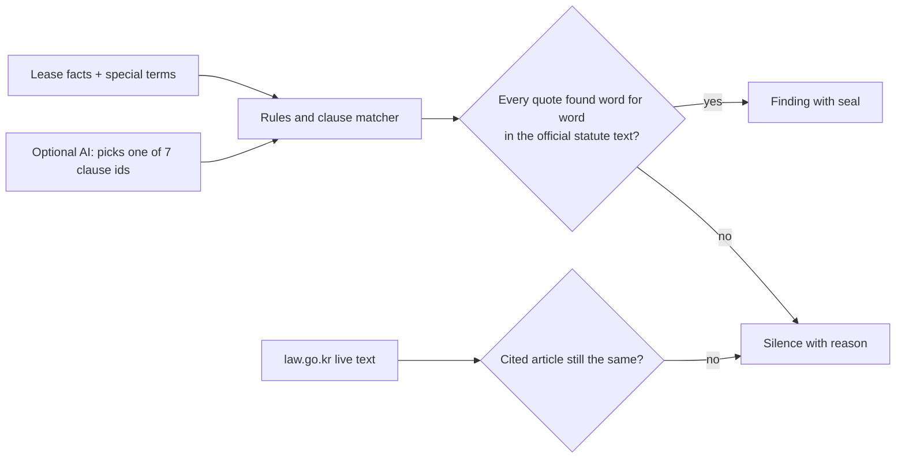

# Jeonse Guard

[](https://github.com/Ryugi62/jeonse-guard/actions/workflows/test.yml)

**Check a Korean jeonse lease before you sign. Every warning links to the article of Korean law it comes from. If no article backs a warning, Jeonse Guard says nothing.**

Live: **https://jeonse-guard-kr.vercel.app** (no login; one-click sample: https://jeonse-guard-kr.vercel.app/?sample=1)
Built for LexHack 2026, tracks: Access to Justice & Civic Tech, and AI Safety, Ethics & Governance.

---

## The problem

In a *jeonse* lease the tenant hands the landlord a lump-sum deposit (often most of a family's savings) instead of monthly rent, and gets it back at the end. When the home is worth less than the debts on it, the deposit disappears.

- **40,936** tenants were officially recognized as jeonse-fraud victims between June 2023 and August 31, 2026. **75.95%** were under 40, and **97.6%** of the deposits were ₩300 million or less. ([MOLIT press release, Sep 7, 2026](https://www.molit.go.kr/USR/NEWS/m_71/dtl.jsp?id=95092387))
- **547** of the recognized victims were foreign nationals. Jeonse Guard's English interface and the official English translations are for them too. (same source)
- **509** victim applications were rejected because the tenant had not secured *opposing power* (move-in registration and a fixed date). The protection existed, but the timing was missed. (same source)
- The government's pre-contract "safe contract consulting" (registry analysis and contract-wording review) is offered at **8 physical centers**. (same source)

Most of the loss is decided *before move-in*: by what is registered ahead of the tenant, and by a few lines of special terms (특약) in the contract. A legal chatbot is a risky answer here. A made-up article is worse than no answer, because the tenant signs on it.

## What it does

1. **Four short screens**: home and deposit, what the registry shows, what the landlord showed you, and the special terms (paste them, Korean or English).
2. **A report that starts with the number**: how much of the deposit is not covered if the home is auctioned, as a "who gets paid first" bar. The auction price is a slider because it is an assumption, not a statistic.
3. **Warnings that wear a seal**: every finding carries a quote from the *Housing Lease Protection Act* or its *Enforcement Decree*. Open the seal and you see the official Korean text and the official English translation (Korea Legislation Research Institute) with the quoted passage highlighted in both, the version date and a link to law.go.kr.
4. **A section called "Where Jeonse Guard stays silent"**: clauses and questions it will not judge, and why.

## Grounded or silent: how a warning gets shown



- A rule never writes free text about the law. It carries a `Citation {law, article, quote}`. The **grounding gate** (`src/domain/grounding.ts`) shows a finding only if every quote appears verbatim, ignoring whitespace, in the Korean text of that article. Otherwise the finding becomes a **silence**.
- Numbers used in the math come from the statute too. The small-deposit thresholds (e.g. Seoul: ₩165,000,000 / ₩55,000,000) are stored as quotes such as `"1. 서울특별시: 1억6천500만원"`, and a test parses the amount out of the quote and compares it with the constant.
- **Law drift**: `/api/verify` runs in the Seoul region (icn1). It fetches the current text of every cited article from the law.go.kr Open API and compares it with the snapshot. If an article changed, findings that cite it are withheld.
- **The AI never cites anything.** Gemini is used only as a classifier. A JSON-schema enum lets it return one of seven clause ids or `none`. The citations attached to that id come from the verified library. Rule matches win over AI labels, and AI-sorted findings are marked "check the clause yourself".

### What it checks

| Check | Grounded in |
|---|---|
| Auction shortfall: who is paid before you, what is left | HLPA Art. 3-2(2) |
| Protection starts the day **after** move-in registration | HLPA Art. 3(1), 3-2(2) |
| Fixed date on the contract | HLPA Art. 3-2(2), 3-6(1) |
| Landlord must show tax certificates and fixed-date records | HLPA Art. 3-7 |
| Small-deposit top priority by region | HLPA Art. 8; Decree Art. 10, 11 |
| Term under two years | HLPA Art. 4(1) |
| Clause: waiver of the renewal right | HLPA Art. 6-3, 10 |
| Clause: delayed move-in registration | HLPA Art. 3(1), 8(1) |
| Clause: landlord may add a mortgage | HLPA Art. 3-2(2), 3(1) |
| Clause: no new mortgage until the day after move-in (good) | HLPA Art. 3(1) |
| Clause: deposit returned only when a new tenant arrives | HLPA Art. 4(2), 3-3(1) |
| Clause: lease ends if the home is sold | HLPA Art. 3(4), 10 |
| Clause: term under two years | HLPA Art. 4(1) |

### Where it stays silent (on purpose)

- Any clause outside the seven types (pets, repairs, cleaning...). There is no verified article that decides it.
- Small-deposit priority when the first mortgage predates Feb. 21, 2023. The decree's addendum says older thresholds apply to that creditor, and they are not in the corpus. This silence carries its own seal.
- Any finding whose citation fails verification, or whose article changed on law.go.kr since the snapshot.
- An AI label outside the taxonomy.

## Measured

**Tests**: 85 (Vitest), including
- citation integrity: every citation shipped in the library verifies against the captured API payload *and* the shipped snapshot (`tests/citationIntegrity.test.ts`);
- the grounding gate drops a finding that has one bad quote (`tests/citation.test.ts`);
- architecture boundaries: `domain/` and `application/` import nothing outward and never call `fetch`, `process.env` or the DOM (`tests/architecture.test.ts`);
- UI acceptance: one primary action per screen, at most two questions per step, report starts with the money at risk, statute text in closed `<details>`, user text escaped, law-check states worded honestly (`tests/ui.test.ts`);
- color contrast of every text/background token pair ≥ 4.5:1 in light and dark themes (`tests/contrast.test.ts`);
- every citation also carries the matching passage of the official English translation, which is highlighted for readers who don't read Korean.

**Post-deploy smoke test**: `npm run smoke -- <url>` checks the page, the live law check and the classifier.

**Clause classifier** (`npm run eval:clauses`, results in `eval/clauses.results.json`, run on 2026-09-24):

| Set | n | Rules only (P / R) | AI only (P / R) | Rules then AI (P / R) |
|---|---|---|---|---|
| dev (seen while writing rules) | 31 | 1.00 / 1.00 | 1.00 / 1.00 | 1.00 / 1.00 |
| paraphrase (seen while tuning) | 24 | 1.00 / 1.00 | 1.00 / 1.00 | 1.00 / 1.00 |
| **blind** (60 clauses written by `gemini-3-flash-preview` from the category definitions, never used for tuning) | 60 | **1.00 / 0.50** | 0.98 / 1.00 | **0.98 / 1.00** |

AI labels outside the taxonomy: **0**. The one false positive was an early-termination clause ("tenant pays rent until the next tenant moves in") that the AI labelled as "deposit tied to a new tenant". That is why AI-sorted findings carry a visible badge. Caveat: the blind set was written by a model of the same family as the classifier (`gemini-3.5-flash-lite`). A human-written set is the next step.

## Architecture

Clean Architecture; dependencies point inward only (enforced by a test).

```
src/domain/          Statute, Citation, grounding gate, rules, clause taxonomy (pure TypeScript, no I/O)
src/application/     assessLease, reviewClauses, withholdDrifted (use cases) + ports
src/adapters/        law.go.kr DRF parser and client, statute snapshot, Gemini classifier
src/infrastructure/  web UI (Vite, no framework, no external fonts)
api/                 Vercel functions: /api/verify (live law check), /api/classify (Gemini)
scripts/             fetch-statutes (snapshot), eval-clauses, gen-blind-clauses, build-vercel
```

The spec with acceptance criteria is in [SPEC.md](SPEC.md). Each AC maps to at least one test, and the test names carry the AC number (`grep -rn "AC-7" tests`).

## Run it

Requires Node.js 22.6 or later (the scripts run TypeScript directly with `--experimental-strip-types`). CI runs typecheck, tests and build on every push.

```bash
npm install
npm test                 # 85 tests
npm run dev              # UI at http://localhost:5173 (API calls fall back gracefully)
npm run build && GEMINI_API_KEY=... npm run serve   # production-like, with /api/*
npm run fetch:statutes   # refresh the statute snapshot from law.go.kr (LAW_OC optional)
GEMINI_API_KEY=... npm run eval:clauses
npm run build:vercel && vercel deploy --prebuilt --prod
```

## Data sources

- Korean statute text and official English translations: National Law Information Center Open API (law.go.kr DRF), Housing Lease Protection Act (MST 276291, in force 2026-01-02) and its Enforcement Decree (MST 287183, in force 2026-07-01; English translation of the version promulgated 2025-12-30). Snapshot taken 2026-09-24 and checked live at runtime.
- Victim statistics: Ministry of Land, Infrastructure and Transport press release, Sep 7, 2026 (link above).

## Tech stack and credits (declared per LexHack rules §4)

- TypeScript 5, Vite 6, Vitest 3, esbuild, Node.js 22.6+ (developed on 24); hosted on Vercel (static site + Node functions in icn1).
- Public APIs: law.go.kr Open API (DRF); Google Gemini API (`gemini-3.5-flash-lite`, fallback `gemini-3-flash-preview`, `gemini-2.5-flash`) used only as a constrained classifier.
- AI tools used to build it: Claude Code (Anthropic) as a coding assistant. Gemini generated the blind evaluation set.
- No pre-existing project code. All code was written during the hackathon (Sep 24–27, 2026).

## Limits

Jeonse Guard is decision support, not legal advice. It checks what the tenant types in; it does not read registry PDFs yet. The auction scenario assumes the tenant holds move-in registration and a fixed date before later creditors, and it ignores auction costs and tax claims. Coverage is six fact checks and seven clause types. Everything else is silence, by design. Free help: Jeonse Damage Support Centers, 1533-8119.

## What's next

1. Read the registry extract (등기부등본) PDF directly, so the senior-debt numbers are not typed in by hand.
2. A human-labelled clause set from real contracts, together with a legal clinic.
3. More laws in the corpus (Civil Act lease articles, Special Act on jeonse-fraud victims). Each new article adds findings, never unverified text.

## License

MIT
